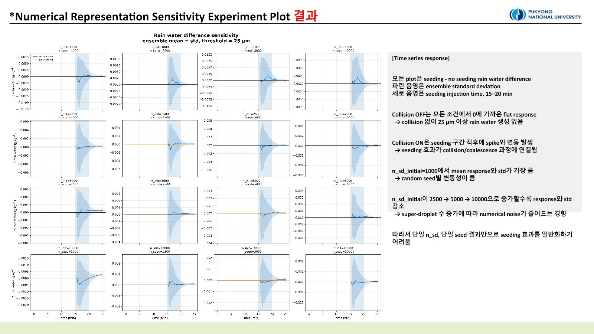

::: {.callout-note title="Provenance"}
This experiment was **not run in PySDM-Seeding-Lab**. It was an independent PySDM study developed in Visual Studio Code and executed on the laboratory server. It later informed the numerical-qualification design of the Seeding Lab.
:::

## Question: is one large response a physical signal?

PySDM represents populations of real particles with super-droplets. `n_sd_initial` and `n_sd_seeding` therefore control more than runtime: they determine how finely the background aerosol distribution, seeded-particle distribution, and stochastic collision pairing are represented.

The first collision ON/OFF comparison used 1,000 for both counts. A single resolution and random seed could not tell us whether a rain-water spike was reproducible or merely a coarse-sampling event. This experiment varies **numerical representation**, not physical seeding dose.

## Design

```text
n_sd_initial = 1,000 / 2,500 / 5,000 / 10,000
n_sd_seeding = 1,000 / 2,500 / 5,000 / 10,000
Formulae seed = 100–149
rain-size threshold = wet radius 25 µm
```

The 4 × 4 grid was repeated with 50 random seeds. Seeding-minus-no-seeding differences were evaluated separately with collision ON and OFF. Instead of selecting one curve, the analysis compared ensemble mean and standard deviation, final/maximum/minimum response, positive and negative integrated area, and the full time series.

An early version increased both super-droplet counts together. That mixed changes in background sampling, seeded-particle sampling, and collision-pair sampling. Crossing the two axes independently was the essential correction.

## Collision OFF produced no rain-size response

Rain-water difference remained nearly zero across every collision-OFF combination. Seeded particles could still take up vapour, but condensation alone did not create a measurable increase above the 25 µm wet-radius threshold in this parcel and time window.

With collision ON, both positive spikes and negative responses appeared just after injection. The perturbation was transient rather than a one-way enhancement. Final values and post-20-minute means were generally close to zero, so this experiment does not establish persistent rain-water enhancement.

## Background representation controlled the variability

{fig-alt="Maximum and minimum rain-water response heatmaps across initial and seeded super-droplet counts"}

The largest ensemble response and spread occurred at `n_sd_initial = 1,000`. When the background distribution is represented by fewer computational particles, each super-droplet carries more real-particle weight and an individual collision event can dominate a threshold-based diagnostic.

Increasing `n_sd_initial` to 2,500, 5,000, and 10,000 generally reduced the magnitude of maximum/minimum response, integrated positive/negative area, and ensemble spread. Changes in `n_sd_seeding` were weaker. In this configuration, the resolution of the existing cloud-droplet population mattered more than the resolution of the injected population.

{fig-alt="Ensemble rain-water difference time series across numerical representations"}

Of 1,600 planned collision-setting comparison outputs, 1,599 completed. One collision-ON member at `n_sd_initial = 1,000`, `n_sd_seeding = 5,000` generated an exceptionally large particle and exceeded an interpolation limit. It is retained as evidence of an outlier mechanism rather than silently discarded.

## Interpretation

A larger spike is not equivalent to stronger seeding. Lower resolution produced larger spikes and greater seed-to-seed variability. Likewise, raising `n_sd_seeding` does not add more seeding material; it changes the computational representation of the same population.

The 25 µm rain threshold is useful but sensitive to threshold crossing. A stronger follow-up should inspect multiple thresholds, wet-radius spectra, and robust ensemble statistics such as median and IQR.

::: {.review-verdict}
**Conclusion.** Collision ON produced transient rain-water perturbations, not a persistent increase. Response magnitude and uncertainty were more sensitive to `n_sd_initial` than to `n_sd_seeding`, so a single resolution and random seed cannot support a generalized seeding claim.
:::

The next step fixes numerical resolution and varies physical particle properties in [Experiment 2](../2026-07-03-parameter-sensitivity/index.qmd).

## Related material

- [Experiment 1 design and interpretation conversation](https://chatgpt.com/share/6a572206-4f94-83ee-9657-8568fa10c487)
- [All experiments](../../../experiments.qmd)

