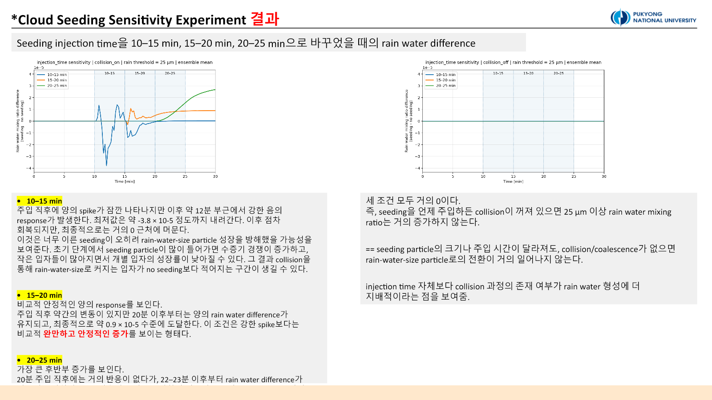

::: {.callout-note title="Provenance"}
Neither the main experiment nor the follow-up used **PySDM-Seeding-Lab**. Both were independent PySDM parcel studies developed in Visual Studio Code and run on the laboratory server. This page combines the 2 July sensitivity study and the 3 July diagnostic follow-up.
:::

## Which particle should be injected, and when?

[Experiment 1](../2026-06-30-numerical-representation/index.qmd) showed that rain-water response is sensitive to representation and random seed. Here, `n_sd_initial = n_sd_seeding = 1,000` was fixed while three physical controls were varied: seeded-particle dry radius, hygroscopicity κ, and injection window.

The PySDM `seeding_no_collisions` parcel framework was extended to four cases per condition: no seeding and seeding with collision ON, then the same pair with collision OFF. Every reported effect is seeding minus its matching no-seeding baseline.

| Sensitivity axis | Values | Fixed settings |
|---|---|---|
| Dry radius | 0.5, 1.0, 2.0 µm | κ = 0.8, 15–20 min |
| κ | 0.3, 0.5, 0.8, 1.0 | dry radius = 1 µm, 15–20 min |
| Injection timing | 10–15, 15–20, 20–25 min | dry radius = 1 µm, κ = 0.8 |

The main study used a 10-member ensemble with Formulae seeds 100–109. Rain water was the water mixing ratio carried by particles with wet radius at least 25 µm.

## Dry radius

{fig-alt="Rain-water response for three dry-radius conditions with collision on and off"}

With collision ON, the final response followed `2 µm > 1 µm > 0.5 µm`. Approximate values on the plotted scale were $2.1\times10^{-5}$, $0.9\times10^{-5}$, and $0.4$–$0.5\times10^{-5}$.

Larger dry particles can reach larger wet sizes and participate in coalescence more readily. However, this was a fixed-number design: increasing dry radius also increased total injected dry mass. The result cannot be interpreted as a pure size effect. That confounding factor motivates the fixed-mass design in Experiment 3.

## Hygroscopicity κ

{fig-alt="Rain-water sensitivity to particle hygroscopicity kappa"}

The late response ranked `κ = 1.0 > 0.8 > 0.5 > 0.3`, with approximate final values of $1.0$, $0.9$, $0.75$, and $0.65\times10^{-5}$. More hygroscopic particles took up water more readily and entered the collision pathway more effectively.

Collision-OFF rain water remained nearly zero across κ. That does not mean nothing changed: vapour, number, and cloud-size radius diagnostics may respond even when condensation alone does not cross the 25 µm threshold.

## Injection timing

{fig-alt="Rain-water response for three injection windows"}

Injection at 10–15 min produced a brief positive spike followed by a negative excursion to roughly $-3.8\times10^{-5}$ and ended near zero. Early injection may have increased vapour competition and small-droplet number before efficient rain-size growth was possible.

The 15–20 min window produced a smoother positive response ending near $0.9\times10^{-5}$. The 20–25 min window rose rapidly after 22–23 min and ended near $2.7\times10^{-5}$, the largest of the three. Because this window is close to the end of the simulation, a large late value does not establish long-term persistence; a longer integration is required.

## Follow-up: tracing the growth pathway

The first analysis emphasized rain water but could not explain the intermediate mechanism. Some concentration and effective-radius products had insufficient finite data or natural NaN intervals.

The follow-up separated particles into `cloud-size (0.5–25 µm)`, `rain-size (≥25 µm)`, and `all activated (≥0.5 µm)` ranges. It expanded ensemble output from the mean to standard deviation, median, q25, q75, successful-member count, and finite fraction. A rain effective radius is naturally undefined before rain-size particles exist, so NaN intervals were evaluated with product-health checks rather than treated automatically as failed runs.

The diagnostics support the following pathway:

```text
seeded-particle injection
→ vapour consumption
→ RH / supersaturation depletion
→ condensational growth and latent heating
→ cloud-size water redistribution
→ collision/coalescence (collision ON)
→ rain-size mass increase
```

Collision OFF could still alter vapour and cloud-size particles, but it produced almost no rain-water increase. With collision ON, vapour and RH/supersaturation decreased, temperature and all-activated water increased, and rain-water mass rose. Number and mass must be read together: coalescence may reduce particle count while increasing individual mass and effective radius.

::: {.review-verdict}
**Conclusion.** Within the tested range, larger dry radius, higher κ, and 20–25 min injection produced stronger late rain-water responses. Dry radius remained confounded with injected mass, and late timing remained confounded with the simulation endpoint, so these are hypotheses for the next experiment—not universal optima.
:::

The next step introduces multiple background aerosol environments and separates fixed-number from fixed-mass injection in [Experiment 3](../2026-07-06-realistic-warm-seeding/index.qmd).

## Related material

- [Experiment 2 and follow-up conversation](https://chatgpt.com/share/6a57222e-4844-83ee-95f9-91bf36f3cfe7)
- [All experiments](../../../experiments.qmd)

