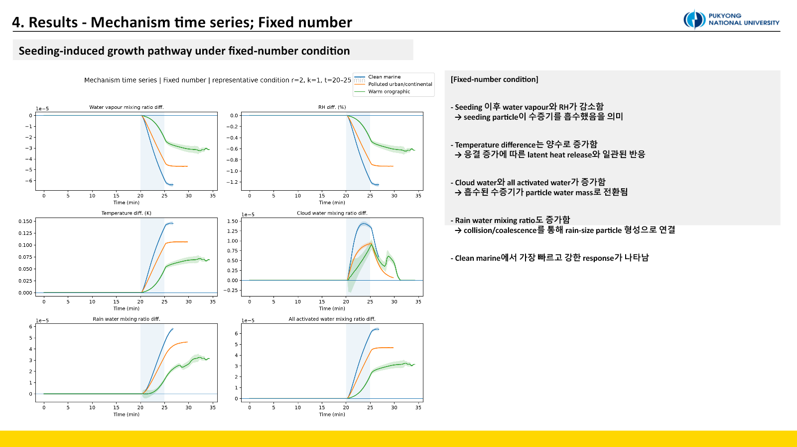
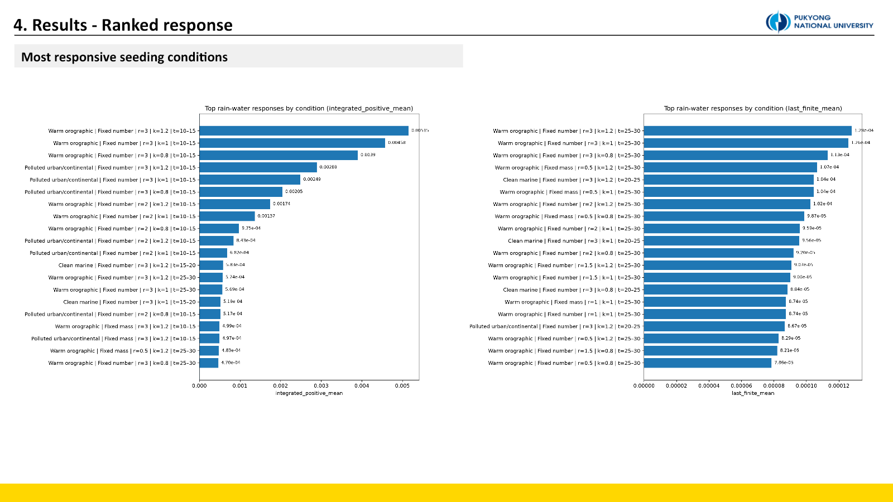

::: {.callout-note title="Provenance"}
This experiment was performed **outside PySDM-Seeding-Lab**. Independent PySDM scripts were developed in Visual Studio Code and executed in parallel on the laboratory server.
:::

## Why add realistic background environments?

[Experiment 2](../2026-07-03-parameter-sensitivity/index.qmd) found stronger responses for larger dry radius, higher κ, and later injection, but used one idealized background and a fixed number of seeded particles. Background aerosol controls vapour competition, while fixed particle number and fixed dry mass ask different efficiency questions.

This experiment asks whether the warm-hygroscopic pathway persists across environments, whether response speed and strength differ, whether large particles remain favorable at fixed mass, and whether the best injection stage depends on the background cloud.

| Environment | Background radius | κ | Number concentration |
|---|---:|---:|---:|
| Clean marine | 0.10 µm | 0.70 | 100 cm⁻³ |
| Polluted urban/continental | 0.07 µm | 0.30 | 1,000 cm⁻³ |
| Warm orographic | 0.08 µm | 0.45 | 300 cm⁻³ |

The seeding grid used dry radii of 0.5, 1.0, 1.5, 2.0, and 3.0 µm; κ of 0.8, 1.0, and 1.2; and injection windows of 10–15, 15–20, 20–25, and 25–30 min. Main runs used collision ON, with representative collision-OFF controls, and a 50-member ensemble.

`Fixed number` injects the same particle count at every dry radius, so particle size and total dry mass change together. `Fixed mass` holds total dry material constant, reducing particle number as radius increases. The latter is closer to a material-limited efficiency question.

## A common pathway, different response regimes

{fig-alt="Mechanism time series for clean marine, polluted continental, and warm orographic environments"}

After injection, water vapour and RH/supersaturation decreased while temperature increased. Water moved into cloud and all-activated particle mass, then into rain water through collision/coalescence. This directional pathway appeared in all three backgrounds.

Under the representative fixed-number condition, clean marine responded first and most strongly. Its low background concentration reduced vapour competition. Polluted conditions were more parameter dependent because many background particles competed for vapour.

Fixed-mass runs retained the same pathway but showed weaker responses overall. Increasing dry radius reduced the number of injected particles, exposing a size–number trade-off. “Larger is better” therefore applies only to the fixed-number comparison.

## Heatmaps and rankings answer different questions

{fig-alt="Integrated positive rain-water response heatmaps across environments and seeding designs"}

`integrated_positive_mean` combines positive-response magnitude and duration. Early injections have more time to accumulate area, so the metric was paired with `last_finite_mean`, the response at the last valid simulation time. This matters because some collision-ON members can stop early after generating extremely large particles. Last-finite value, integrated response, median/IQR, and finite fraction must be interpreted together.

{fig-alt="Ranked seeding conditions by integrated and last-finite rain-water response"}

Clean marine was fastest in the representative time series, yet warm-orographic cases occupied many top positions across the full grid. The views are not contradictory: one compares environments at one representative setting; the other searches all parameter combinations.

- Clean marine: a fast-response regime
- Warm orographic: a conditional amplification regime under large radius and late injection
- Polluted continental: a strongly parameter-dependent regime

Clean marine responded strongly around 20–25 min, while warm-orographic top conditions favored 25–30 min injection. Optimal timing reflects environment-specific cloud development rather than a universal “later is better” rule.

## Microphysical response is not operational suitability

This parcel experiment measures internal microphysical rain-water response. Operational targeting also depends on predictability, lifetime, precipitation delivery, and water-resource value. A fast marine response is not automatically the best operational target. Many real orographic programs also involve mixed-phase or glaciogenic—not warm-hygroscopic—seeding, so this result cannot be generalized to all mountain-cloud seeding.

::: {.review-verdict}
**Conclusion.** The warm-hygroscopic pathway persisted across all three backgrounds, but its strength and timing were environment dependent. Large particles were favorable at fixed number, while fixed mass exposed a size–number trade-off. Efficiency cannot be reduced to particle size alone.
:::

Top-ranked conditions still require robust checks of median, IQR, finite fraction, and early-stop fraction. [Experiment 4](../2026-07-08-efficiency-response-surface/index.qmd) next fixes the background and maps the κ–radius–timing interaction densely.

## Related material

- [Experiment 3 design and interpretation conversation](https://chatgpt.com/share/6a572246-27b4-83e8-98e9-a077a40ecb7c)
- [All experiments](../../../experiments.qmd)

