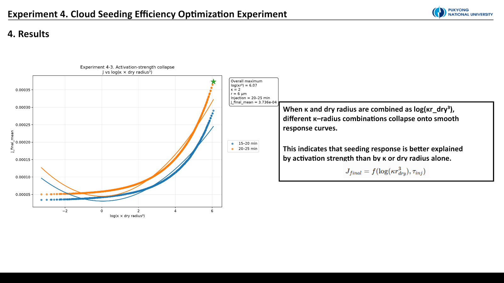

::: {.callout-note title="Provenance"}
This experiment was **not executed in PySDM-Seeding-Lab**. It used separate PySDM scripts in Visual Studio Code on the laboratory server. Every “maximum” below is limited to the tested parameter range and is not an operational optimum.
:::

## Can seeding response be compressed into an empirical law?

Previous experiments varied dry radius, κ, and injection timing one axis at a time. Yet κ and radius are coupled through activation, while injection timing changes both available growth time and cloud maturity.

Experiment 4 asks whether dry radius or κ dominates, whether they can be combined as $kappa r_{dry}^3$, whether timing interacts with activation strength, and whether final rain-water response can be represented by an empirical surface.

## From preliminary tests to Experiment 4-3

Experiment 4-1 established an initial surface. Experiment 4-2 extended radius to 10 µm, but direct crossing of the 25 µm rain threshold by very large seeds began to dominate interpretation. These were diagnostic steps, not failures.

Experiment 4-3 narrowed the interpretable radius range to 0.5–6.0 µm and sampled it at 0.1 µm spacing. It became the main dataset.

```text
collision = ON
terminal velocity = RogersYau
κ = 0.3–2.0, step 0.1       → 18 values
dry radius = 0.5–6.0 µm     → 56 values
injection = 15–20 / 20–25 min
ensemble seeds = 20
t_max = 30 min
```

The grid contains $18\times56\times2=2{,}016$ conditions. Each used 20 ensemble seeds and the same no-seeding baseline. The main objective was final rain-water difference $J_{final}$; integrated positive and maximum responses were secondary metrics.

## Monotonic response toward larger κ and radius

{fig-alt="Response surface heatmaps over kappa and dry radius for two injection windows"}

Both windows increased toward larger κ and dry radius. Radius showed the stronger, nearly monotonic effect; κ was weaker but consistently positive. Only one decreasing case occurred among 1,904 adjacent κ comparisons.

The 20–25 min window exceeded the 15–20 min window across every tested condition. The late/early $J_{final}$ ratio averaged about 1.36 and ranged from 1.29 to 1.46.

The maximum occurred at the upper boundary: `κ = 2.0`, `dry radius = 6.0 µm`, and `20–25 min`. Because it lies on a boundary, it is only the maximum inside this grid—not a universal optimum.

## Activation strength and timing

Define a Köhler-like activation coordinate:

$$
A=\log\!\left(\kappa r_{dry}^{3}\right).
$$

The final response was fitted with a quadratic function of activation coordinate $A$ and injection coordinate $\tau$:

$$
J_{final}=\beta_0+\beta_1A+\beta_2\tau+\beta_3A^2+\beta_4\tau^2+\beta_5A\tau+\epsilon.
$$

{fig-alt="Activation-strength collapse showing separated curves for two injection windows"}

The two injection windows formed separated curves. Timing is therefore not merely a constant offset; it interacts with particle strength. The positive interaction coefficient indicates that strong particles and later injection reinforced one another within this model configuration.

| Term | Coefficient |
|---|---:|
| $\beta_0$ intercept | $1.59\times10^{-6}$ |
| $\beta_1$ activation linear | $-3.16\times10^{-5}$ |
| $\beta_2$ timing linear | $2.90\times10^{-5}$ |
| $\beta_3$ activation curvature | $6.73\times10^{-6}$ |
| $\beta_4$ timing curvature | $3.80\times10^{-5}$ |
| $\beta_5$ activation × timing | $4.69\times10^{-5}$ |

{fig-alt="Fitted empirical response relationship with coefficients and fit statistics"}

The fit achieved $R^2=0.970$, RMSE $=1.23\times10^{-5}$, and $n=2{,}016$. This is an empirical compression of one fixed background, collision model, threshold, timing definition, and parameter normalization. It is not a universal physical law.

Radius enters activation strength through a cubic volume term and dominated κ over this range. Higher κ consistently supported activation and water uptake. Later injection allowed seeded particles to interact with a more mature parcel state.

::: {.review-verdict}
**Conclusion.** Within the tested range, $J_{final}$ was well organized by $\log(\kappa r_{dry}^3)$ and injection timing. Dry radius supplied the dominant main effect, while late injection reinforced strong particles. The upper-boundary maximum is a direction for the next grid, not a final optimum.
:::

## Next research

A generalized response law should add fixed-number versus fixed-mass dose normalization, background aerosol sensitivity, a cloud-maturity/updraft coordinate instead of absolute time, and joint dependence on particle property, dose, background, and cloud state.

## Related material

- [Experiment 4 design and interpretation conversation](https://chatgpt.com/share/6a5721de-e4bc-83ee-9d0d-21b6caf6b0fa)
- [All experiments](../../../experiments.qmd)

