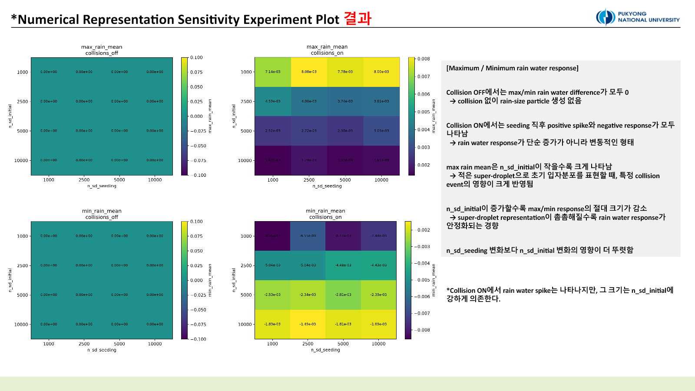

::: {.callout-note title="실험 출처"}
이 실험은 **PySDM-Seeding-Lab에서 실행한 결과가 아니다.** 연구실 서버에서 Visual Studio Code로 작성·실행한 독립 PySDM 실험이며, 이후 Seeding Lab의 수치 검증 설계에 참고한 선행 연구 기록이다.
:::

## 질문: 한 번의 큰 반응을 물리 신호로 믿어도 될까

PySDM은 실제 입자 전체를 계산하지 않고, 하나의 super-droplet이 같은 성질을 가진 실제 입자 집단을 대표하게 한다. 따라서 `n_sd_initial`과 `n_sd_seeding`은 단순한 속도 조절값이 아니다. 초기 에어로졸 분포, 시딩 입자 분포, 확률적 collision pair sampling을 얼마나 촘촘히 표현하는지를 결정한다.

초기 collision ON/OFF 비교는 두 값을 모두 1,000으로 두었다. 하지만 단일 해상도와 단일 random seed에서 나타난 rain-water spike가 재현 가능한 시딩 반응인지, 거친 입자 표현이 만든 numerical noise인지 구분할 수 없었다. 이 실험의 목적은 **물리적 시딩 양**이 아니라 **수치 표현 민감도**를 분리하는 것이다.

## 설계

초기 입자와 시딩 입자 해상도를 각각 네 수준으로 바꿨다.

```text
n_sd_initial = 1,000 / 2,500 / 5,000 / 10,000
n_sd_seeding = 1,000 / 2,500 / 5,000 / 10,000
Formulae seed = 100–149
rain-size threshold = wet radius 25 µm
```

4 × 4의 16개 조합마다 50개 random seed를 사용하고, collision ON과 OFF에서 각각 seeding–no-seeding 차이를 계산했다. 해상도 조합별 단일 곡선 대신 ensemble mean, standard deviation, final/max/min response, 양·음의 누적 면적을 비교했다.

초기에는 `n_sd_initial`과 `n_sd_seeding`을 함께 늘렸지만, 그 결과로는 어느 축이 반응을 바꿨는지 알 수 없었다. 그래서 두 축을 독립적으로 교차시킨 것이 이 실험의 핵심 수정이다.

## 결과 1. Collision이 없으면 rain-size 반응도 없었다

Collision OFF에서는 모든 해상도 조합의 rain water difference가 거의 0이었다. 시딩 입자가 주입되고 응결할 수는 있어도, 이 parcel 설정에서는 응결만으로 wet radius 25 µm 이상 영역의 물 질량 증가가 만들어지지 않았다.

Collision ON에서는 주입 직후 양의 spike와 음의 response가 함께 나타났다. 즉 시딩 효과는 일방적인 증가가 아니라, threshold 주변 입자의 이동과 stochastic collision event가 섞인 **일시적 변동**이었다. 최종 시점과 20분 이후 평균은 대부분 0에 가까워 이 실험만으로 지속적인 rain-water enhancement를 주장할 수 없다.

## 결과 2. `n_sd_initial`이 변동성을 더 크게 지배했다

{fig-alt="Maximum and minimum rain-water response heatmaps across initial and seeded super-droplet counts"}

`n_sd_initial = 1,000`일 때 ensemble mean response와 표준편차가 가장 컸다. 초기 입자분포를 적은 대표 입자로 표현하면 한 super-droplet이 담당하는 실제 입자 수가 커지고, 특정 collision event 하나가 rain-water diagnostic에 크게 반영될 수 있다.

`n_sd_initial`을 2,500, 5,000, 10,000으로 늘리자 maximum/minimum response와 누적 양·음 면적의 절대값이 전반적으로 작아졌다. 반면 `n_sd_seeding` 변화의 영향은 상대적으로 약했다. 이 결과는 시딩 입자 표현보다 **시딩 입자가 상호작용하는 기존 cloud-droplet population의 해상도**가 이 설정의 rain response에 더 큰 영향을 주었음을 시사한다.

{fig-alt="Ensemble rain-water difference time series across numerical representations"}

계획한 1,600개 collision-setting별 comparison output 중 1,599개가 완료됐다. Collision ON, `n_sd_initial = 1,000`, `n_sd_seeding = 5,000`에서 한 member가 매우 큰 입자를 만들며 interpolation limit을 넘었다. 이 실패를 제거 대상이 아니라 거친 representation과 stochastic collision이 만드는 outlier 증거로 남겼다.

## 무엇을 배웠나

첫째, 큰 spike는 큰 시딩 효과와 동의어가 아니다. 해상도가 낮을수록 오히려 spike와 seed 간 분산이 커졌다. 둘째, `n_sd_seeding` 증가는 실제 투입 물질량 증가가 아니라 같은 분포를 더 많은 계산 입자로 표현하는 변화다. 이 축을 물리적 시딩 강도로 해석하면 안 된다.

셋째, wet radius 25 µm라는 threshold는 해석을 쉽게 하지만 threshold crossing에 민감하다. 후속 실험에서는 여러 radius threshold, wet-radius spectrum, ensemble median/IQR을 함께 봐야 한다.

::: {.review-verdict}
**결론.** Collision ON에서 순간적인 rain-water perturbation은 나타났지만 지속적인 증가는 아니었다. 반응 크기와 불확실성은 `n_sd_seeding`보다 `n_sd_initial`에 더 민감했으며, 단일 해상도·단일 seed 결과로 시딩 효과를 일반화할 수 없다.
:::

## 다음 실험으로

수치 표현의 영향을 확인했으므로 다음 단계에서는 해상도를 고정하고 dry radius, κ, injection timing 같은 물리 조건만 바꾼다. 그 흐름은 [Experiment 2](../2026-07-03-parameter-sensitivity/index.qmd)에서 이어진다.

## 연결 자료

- [Experiment 1 설계·해석 대화](https://chatgpt.com/share/6a572206-4f94-83ee-9657-8568fa10c487)
- [Experiments 목록](../../../experiments.qmd)

