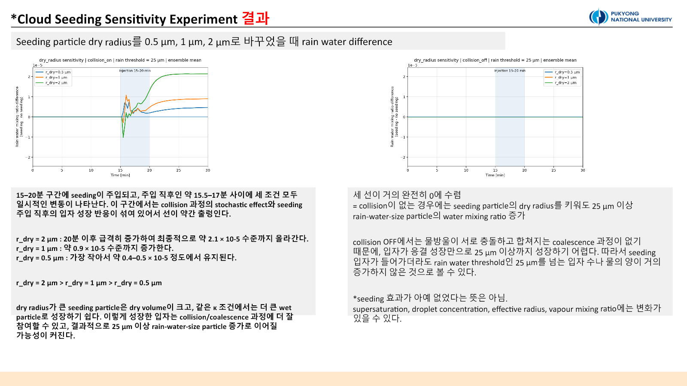
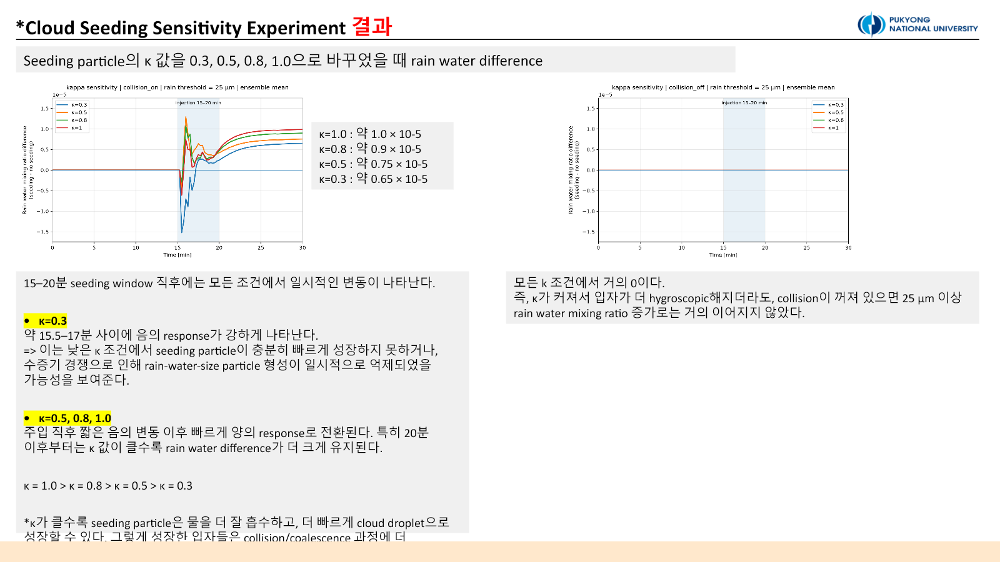

::: {.callout-note title="실험 출처"}
본편과 Follow-Up Study 모두 **PySDM-Seeding-Lab을 사용하지 않았다.** 연구실 서버와 Visual Studio Code에서 수행한 독립 PySDM parcel 실험이다. 본문은 2026-07-02 민감도 실험과 2026-07-03 후속 진단을 한 흐름으로 합쳤다.
:::

## 질문: 어떤 입자를 언제 넣어야 하는가

[Experiment 1](../2026-06-30-numerical-representation/index.qmd)은 rain-water response가 수치 표현과 random seed에 민감하다는 점을 보여줬다. 이번에는 `n_sd_initial = n_sd_seeding = 1,000`으로 고정하고, 시딩 입자의 물리적 성질과 주입 시점만 바꿨다.

질문은 세 가지다.

1. Dry radius가 큰 입자는 25 µm 이상 rain-size 질량을 더 많이 만드는가?
2. 흡습성 κ가 커질수록 수증기 흡수와 rain response가 강해지는가?
3. 같은 입자라도 cloud parcel의 어느 성장 단계에 주입하는지가 결과를 바꾸는가?

## 실험 설계

PySDM `seeding_no_collisions` 예제의 adiabatic parcel 구조를 확장했다. 각 조건마다 `no seeding + collision ON`, `seeding + collision ON`, `no seeding + collision OFF`, `seeding + collision OFF`의 네 case를 실행하고 seeding에서 no-seeding을 뺀 차이를 계산했다.

| 민감도 축 | 조건 | 고정 조건 |
|---|---|---|
| Dry radius | 0.5, 1.0, 2.0 µm | κ = 0.8, 15–20 min |
| κ | 0.3, 0.5, 0.8, 1.0 | dry radius = 1 µm, 15–20 min |
| Injection timing | 10–15, 15–20, 20–25 min | dry radius = 1 µm, κ = 0.8 |

본편은 Formulae seed 100–109의 10-member ensemble을 사용했다. Rain water는 wet radius 25 µm 이상 입자의 water mixing ratio로 정의했다.

## Dry radius: 큰 입자가 더 강했지만, 질량 효과도 섞여 있다

{fig-alt="Rain-water response for three dry-radius conditions with collision on and off"}

Collision ON에서 최종 rain-water response는 plot scale 기준으로 대략 `2 µm > 1 µm > 0.5 µm` 순이었다. 2 µm는 약 $2.1\times10^{-5}$, 1 µm는 약 $0.9\times10^{-5}$, 0.5 µm는 약 $0.4$–$0.5\times10^{-5}$ 수준이었다.

큰 dry particle은 같은 κ에서 더 큰 wet particle로 성장하고 collision/coalescence에 참여하기 쉽다. 다만 이 실험은 같은 **입자 수**를 주입했기 때문에 dry radius를 키우면 총 dry material mass도 함께 커진다. 따라서 이 결과를 입자 크기만의 순수 효과로 볼 수는 없다. 이 한계가 Experiment 3의 fixed-mass 설계로 이어졌다.

## κ: 흡습성이 높을수록 response가 커졌다

{fig-alt="Rain-water sensitivity to particle hygroscopicity kappa"}

Collision ON에서 후반부 response는 `κ = 1.0 > 0.8 > 0.5 > 0.3` 순으로 커졌다. 최종 값은 plot scale 기준 약 $1.0$, $0.9$, $0.75$, $0.65\times10^{-5}$였다. κ가 큰 입자는 더 낮은 activation barrier와 빠른 수분 흡수로 성장하고, 이후 collision pathway에 더 효과적으로 들어간 것으로 해석했다.

Collision OFF에서는 κ가 달라도 rain water가 거의 0이었다. 이것은 시딩 효과 자체가 없다는 뜻이 아니다. Water vapour, droplet number, effective radius 같은 cloud-size diagnostic은 변할 수 있지만, 이 parcel과 시간 범위에서는 응결 성장만으로 25 µm threshold를 넘지 못했다는 뜻이다.

## Injection timing: 가장 큰 차이를 만든 축

{fig-alt="Rain-water response for three injection windows"}

10–15분 주입은 짧은 양의 spike 뒤 약 $-3.8\times10^{-5}$까지 내려가는 음의 response를 보였고 최종 값은 0에 가까웠다. 초기 단계에서 작은 입자 수와 수증기 경쟁이 늘어 개별 입자의 rain-size 성장을 늦췄을 가능성이 있다.

15–20분은 급격한 spike보다 안정적인 양의 증가를 보였고 최종 약 $0.9\times10^{-5}$에 도달했다. 20–25분은 22–23분 이후 빠르게 증가해 최종 약 $2.7\times10^{-5}$로 가장 컸다. 그러나 이 window는 simulation 종료 시점에 가깝다. **후반부 값이 크다는 사실과 장시간 지속된다는 사실은 다르며**, 장기 지속성은 더 긴 integration으로 확인해야 한다.

## Follow-Up Study: rain water 하나에서 성장 경로로

본편의 rain-water 곡선만으로는 수증기가 어디로 갔고, cloud-size 입자가 어떻게 rain-size 질량으로 바뀌었는지 설명하기 어려웠다. 일부 concentration/effective-radius product에는 유효 자료가 부족하거나 NaN 구간이 있었다.

후속 연구에서는 입자 범위를 `cloud-size (0.5–25 µm)`, `rain-size (≥25 µm)`, `all activated (≥0.5 µm)`로 분리했다. Ensemble 통계도 mean뿐 아니라 standard deviation, median, q25, q75, `n_success`, finite fraction으로 확장했다. Rain-size 입자가 아직 없는 시간의 effective radius NaN은 계산 실패가 아니라 정의상 자연스러운 빈 구간일 수 있으므로 health check와 함께 해석했다.

진단을 연결하면 다음 경로가 나타났다.

```text
seeding particle injection
→ water vapour consumption
→ RH / supersaturation depletion
→ condensational growth + latent heating
→ cloud-size water redistribution
→ collision/coalescence (collision ON)
→ rain-size mass increase
```

Collision OFF에서도 수증기 소모와 cloud-size 입자 변화는 나타날 수 있었다. 그러나 rain water는 거의 증가하지 않았다. Collision ON에서는 water vapour와 RH/supersaturation이 감소하고 temperature와 all-activated water가 증가한 뒤 rain water 증가로 연결됐다. 입자 수가 늘지 않거나 줄어도 개별 입자 질량과 effective radius가 커질 수 있으므로, **number response와 mass response를 함께 봐야 한다.**

::: {.review-verdict}
**결론.** 시험 범위에서는 큰 dry radius, 높은 κ, 20–25분 주입이 더 큰 후반부 rain-water response를 보였다. 다만 dry radius에는 투입 질량 효과가 섞였고, 늦은 주입은 종료 시점 효과가 있으므로 보편적 최적값이 아니라 다음 실험의 가설이다.
:::

## 다음 실험으로

다음 단계는 이상화된 한 환경을 벗어나 clean marine, polluted continental, warm orographic 배경을 비교하고, fixed-number와 fixed-mass를 분리하는 것이다. [Experiment 3](../2026-07-06-realistic-warm-seeding/index.qmd)에서 이어진다.

## 연결 자료

- [Experiment 2 및 Follow-Up Study 설계·해석 대화](https://chatgpt.com/share/6a57222e-4844-83ee-95f9-91bf36f3cfe7)
- [Experiments 목록](../../../experiments.qmd)

