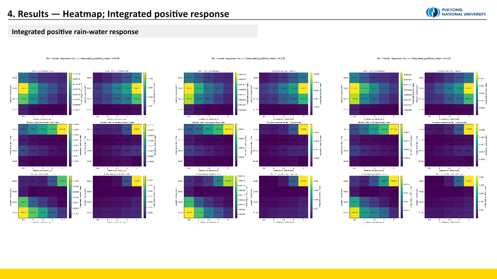

::: {.callout-note title="실험 출처"}
이 실험은 **PySDM-Seeding-Lab 외부**에서 수행했다. 연구실 서버의 20-core 병렬 실행과 Visual Studio Code 기반 스크립트를 사용한 독립 PySDM 연구이며, Seeding Lab 결과로 표기하지 않는다.
:::

## 왜 현실적인 배경 환경이 필요한가

[Experiment 2](../2026-07-03-parameter-sensitivity/index.qmd)는 큰 dry radius, 높은 κ, 늦은 injection이 강한 response를 만드는 경향을 보였다. 그러나 하나의 이상화된 background와 fixed-number 주입만 사용했다. 실제로는 배경 에어로졸 수와 흡습성이 수증기 경쟁을 바꾸고, 같은 입자 수를 넣는 것과 같은 건조질량을 넣는 것은 전혀 다른 질문이다.

이번 실험은 네 가지를 묻는다.

1. 배경 환경이 달라도 warm hygroscopic seeding pathway가 유지되는가?
2. Clean, polluted, orographic 환경의 반응 속도와 강도는 어떻게 다른가?
3. 총 시딩 질량을 고정해도 큰 입자가 항상 유리한가?
4. 최적 injection timing은 환경마다 달라지는가?

## 세 개의 background와 두 개의 주입 규칙

| Environment | Background dry radius | κ | Number concentration |
|---|---:|---:|---:|
| Clean marine | 0.10 µm | 0.70 | 100 cm⁻³ |
| Polluted urban/continental | 0.07 µm | 0.30 | 1,000 cm⁻³ |
| Warm orographic | 0.08 µm | 0.45 | 300 cm⁻³ |

Seeding dry radius는 0.5, 1.0, 1.5, 2.0, 3.0 µm, κ는 0.8, 1.0, 1.2, injection window는 10–15, 15–20, 20–25, 25–30분으로 구성했다. Main simulation은 collision ON이며 대표 control만 collision OFF로 실행했다. 각 조건은 50-member ensemble로 계산했다.

`fixed number`는 dry radius가 달라도 같은 수의 시딩 입자를 넣는다. 입자 크기 효과와 총 투입 질량 효과가 함께 바뀐다. `fixed mass`는 전체 dry material mass를 고정하므로 입자가 커질수록 주입되는 입자 수가 줄어든다. 실제 재료가 제한된 상황의 efficiency를 묻는 데 더 적합하다.

## 성장 경로는 세 환경에서 모두 유지됐다

{fig-alt="Mechanism time series for clean marine, polluted continental, and warm orographic environments"}

시딩 뒤 water vapour와 RH/supersaturation이 감소하고 temperature가 증가했다. 흡수된 수증기는 cloud water와 all-activated water로 이동했고, collision/coalescence와 결합해 rain water 증가로 이어졌다. 이 방향은 세 background에서 공통으로 나타났다.

대표 fixed-number 조건에서는 clean marine 반응이 가장 빠르고 강했다. 배경 입자 수가 적어 수증기 경쟁이 약하고 시딩 입자가 빠르게 성장한 것으로 해석했다. Polluted 환경은 많은 background aerosol 때문에 조건 의존성이 컸다.

Fixed-mass에서는 같은 mechanism 방향이 유지됐지만 response가 전반적으로 작아졌다. 큰 입자의 activation advantage와 줄어든 particle number 사이에 trade-off가 생겼기 때문이다. 따라서 “입자가 클수록 항상 좋다”는 결론은 fixed-number에 한정된다.

## Heatmap과 ranking은 서로 다른 질문에 답한다

{fig-alt="Integrated positive rain-water response heatmaps across environments and seeding designs"}

`integrated_positive_mean`은 양의 rain-water difference가 시간에 걸쳐 얼마나 누적됐는지 보여준다. 이 값은 response의 강도와 지속시간을 함께 담지만, early injection은 적분 시간이 길어 유리해질 수 있다. 그래서 simulation이 유효했던 마지막 시점의 `last_finite_mean`도 함께 비교했다.

일부 collision ON member는 매우 큰 입자 성장으로 조기 종료될 수 있다. 단순 final value 대신 last finite response, integrated response, median/IQR, finite fraction을 함께 보는 이유다.

{fig-alt="Ranked seeding conditions by integrated and last-finite rain-water response"}

대표 time series에서는 clean marine이 가장 빠르지만, 전체 grid의 top-ranked conditions에는 warm orographic이 많이 나타났다. 모순이 아니다. 첫 그림은 한 대표 조건의 **반응 속도**를, ranking은 모든 조합 중 **가장 강한 조건**을 본다.

- Clean marine: 대표 조건에서 빠른 반응형
- Warm orographic: large dry radius와 late injection이 맞으면 강하게 증폭되는 조건형
- Polluted urban/continental: 높은 배경 입자 수 때문에 parameter dependence가 큰 환경

Clean marine은 20–25분 조건에서 빠른 반응을 보였고, warm orographic은 25–30분 late injection에서 강한 조건이 나타났다. 최적 시점은 단순히 “늦을수록”이 아니라 각 환경의 cloud development stage와 연결된다.

## 미세물리 response와 실제 운영 적합성은 다르다

이 실험은 parcel 내부의 microphysical rain-water response를 비교한다. 실제 시딩 대상 선정에는 구름의 위치 예측 가능성, 수명, 강수 전달 위치, 수자원 가치가 추가로 필요하다. Clean marine의 빠른 반응이 곧 운영상 최적 대상이라는 뜻은 아니다. 또한 실제 orographic seeding에는 warm hygroscopic이 아닌 mixed-phase/glaciogenic 방식도 많으므로 이 결과를 모든 지형성 시딩에 확장할 수 없다.

::: {.review-verdict}
**결론.** Warm hygroscopic pathway는 세 background에서 유지됐지만 강도와 최적 timing은 환경 의존적이었다. Fixed-number에서는 큰 입자가 강했지만 fixed-mass에서는 크기–개수 trade-off가 나타나, efficiency를 particle size 하나로 설명할 수 없었다.
:::

## 남은 검증

Top-ranked condition이 일부 seed에 좌우되지 않는지 median, IQR, finite/early-stop fraction을 더 엄격히 확인해야 한다. 다음 실험에서는 환경을 하나로 고정한 채 κ, dry radius, timing의 상호작용을 조밀한 response surface로 만들고, “시험 범위 안의 최대”와 “보편적 최적”을 구분한다.

[Experiment 4로 이어서 읽기](../2026-07-08-efficiency-response-surface/index.qmd)

## 연결 자료

- [Experiment 3 설계·해석 대화](https://chatgpt.com/share/6a572246-27b4-83e8-98e9-a077a40ecb7c)
- [Experiments 목록](../../../experiments.qmd)

