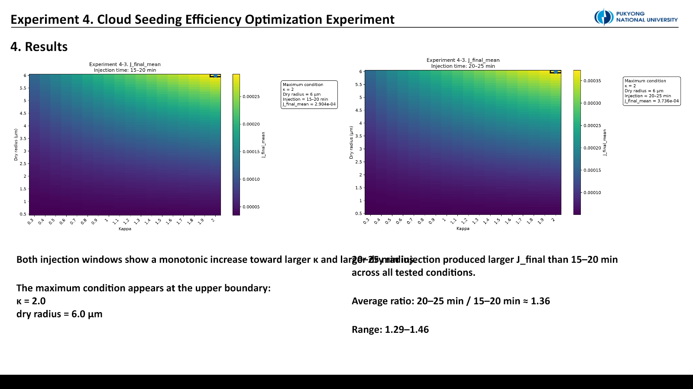
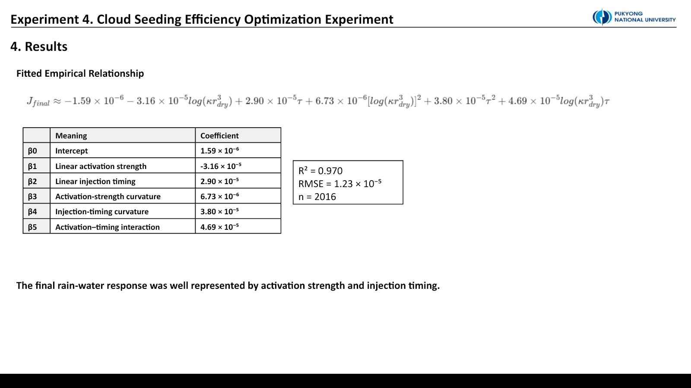

::: {.callout-note title="실험 출처"}
이 실험은 **PySDM-Seeding-Lab에서 실행하지 않았다.** 연구실 서버와 Visual Studio Code에서 별도 스크립트로 수행한 PySDM 실험이다. 아래의 “최대”는 시험한 parameter range 안의 결과이며 운영 최적값이 아니다.
:::

## 질문: 시딩 response를 하나의 경험식으로 정리할 수 있을까

앞선 실험은 dry radius, κ, injection timing을 한 축씩 바꿨다. 그러나 κ와 입자 크기는 activation에서 독립적이지 않으며, 주입 시점은 입자 성장 가능 시간과 cloud maturity를 함께 바꾼다.

Experiment 4는 다음을 묻는다.

1. Rain-water response는 dry radius와 κ 중 어느 쪽에 더 민감한가?
2. 두 입자 성질을 $kappa r_{dry}^3$라는 activation-strength variable로 묶을 수 있는가?
3. Injection timing은 particle activation strength와 상호작용하는가?
4. 최종 response를 경험적 response surface로 표현할 수 있는가?

## 왜 Experiment 4-3을 main dataset으로 썼나

4-1은 초기 response-surface 구조를 확인했고, 4-2는 dry radius를 10 µm까지 넓혔다. 큰 response가 나타났지만 large seed 자체가 25 µm rain threshold를 넘는 효과가 지배적이어서 해석 범위를 흐렸다.

4-3은 dry radius 0.5–6.0 µm로 범위를 좁히고 0.1 µm 간격의 조밀한 grid를 만들었다. 4-1과 4-2는 실패가 아니라, main dataset의 해석 가능한 범위를 정한 preliminary/diagnostic step이다.

## 실험 grid와 목적함수

```text
collision = ON
terminal velocity = RogersYau
κ = 0.3–2.0, step 0.1       → 18 values
dry radius = 0.5–6.0 µm     → 56 values
injection = 15–20 / 20–25 min
ensemble seeds = 20
t_max = 30 min
```

총 조건은 $18\times56\times2=2{,}016$개다. 각 조건은 20개 ensemble seed로 실행하고 고정된 no-seeding baseline과 비교했다. Main metric은 최종 rain-water difference $J_{final}$, 보조 지표는 양의 response 시간적분과 maximum response다.

## 결과 1. 큰 κ와 큰 dry radius 방향으로 단조 증가했다

{fig-alt="Response surface heatmaps over kappa and dry radius for two injection windows"}

두 injection window 모두 큰 κ와 큰 dry radius 방향으로 response가 증가했다. Dry radius의 효과가 더 강하고 거의 단조로웠으며, κ도 더 약하지만 일관된 양의 효과를 보였다. κ 방향의 1,904개 인접 비교 중 감소는 한 경우뿐이었다.

20–25분 주입은 모든 시험 조건에서 15–20분보다 큰 $J_{final}$을 보였다. Late/early ratio 평균은 약 1.36, 범위는 1.29–1.46이었다. 이는 이 설정에서 더 성숙한 parcel에 주입할 때 입자 activation과 rain-size growth가 함께 강화됐음을 보여준다.

시험 범위의 최대는 `κ = 2.0`, `dry radius = 6.0 µm`, `20–25 min`의 upper boundary에 있었다. 경계에서 최대가 나왔으므로 **보편적 optimum이 아니라 이 grid 안의 maximum**으로만 해석한다.

## 결과 2. Activation strength와 timing을 함께 써야 했다

Köhler-like activation coordinate를 다음처럼 정의했다.

$$
A = \log\!\left(\kappa r_{dry}^{3}\right)
$$

최종 response는 activation coordinate $A$와 injection coordinate $\tau$의 이차식으로 fitting했다.

$$
J_{final}=\beta_0+\beta_1A+\beta_2\tau+\beta_3A^2+\beta_4\tau^2+\beta_5A\tau+\epsilon
$$

{fig-alt="Activation-strength collapse showing separated curves for two injection windows"}

두 injection window는 하나로 겹치지 않고 분리된 curve를 만들었다. 즉 timing은 독립적인 일정 offset이 아니라 particle strength와 상호작용한다. Positive interaction term은 강한 입자와 늦은 주입이 서로의 효과를 보강했음을 나타낸다.

## 경험식 fit

| 항 | 계수 |
|---|---:|
| $\beta_0$ intercept | $1.59\times10^{-6}$ |
| $\beta_1$ activation linear | $-3.16\times10^{-5}$ |
| $\beta_2$ timing linear | $2.90\times10^{-5}$ |
| $\beta_3$ activation curvature | $6.73\times10^{-6}$ |
| $\beta_4$ timing curvature | $3.80\times10^{-5}$ |
| $\beta_5$ activation × timing | $4.69\times10^{-5}$ |

{fig-alt="Fitted empirical response relationship with coefficients and fit statistics"}

Fit 성능은 $R^2=0.970$, RMSE $=1.23\times10^{-5}$, $n=2{,}016$이었다. 이 높은 설명력은 **현재 고정 background, collision model, rain threshold, parameter normalization** 안에서의 경험적 압축이다. 물리 법칙이나 외부 환경에 대한 검증을 뜻하지 않는다.

## 해석과 제한

Dry radius는 $r^3$의 부피 효과로 activation strength에 강하게 들어가며, 시험 범위에서는 κ보다 response를 더 크게 지배했다. κ는 activation barrier를 낮추고 물 흡수를 돕는 방향으로 일관되게 작용했다. Late injection은 cloud parcel이 더 성숙한 상태에서 시딩 입자가 rain-water growth에 기여하도록 했다.

하지만 이 실험은 collision ON, 한 background, 두 absolute-time window, fixed seeding design에 한정된다. 또한 25 µm threshold와 30분 종료 시점이 목적함수에 들어간다. 따라서 식을 다른 cloud state나 실제 살포 효율에 그대로 적용하면 안 된다.

::: {.review-verdict}
**결론.** 시험한 범위에서 $J_{final}$은 $\log(\kappa r_{dry}^3)$와 injection timing으로 잘 정리됐고, dry radius가 주효과, late injection이 강화효과를 보였다. 그러나 upper-boundary maximum은 보편적 최적값이 아니라 다음 grid를 어디로 확장할지 알려주는 표지다.
:::

## 다음 연구

다음 response law에는 네 요소가 더 필요하다.

- Fixed particle number와 fixed dry mass를 분리한 seeding-dose normalization
- Clean/moderate/polluted background aerosol sensitivity
- Absolute time 대신 updraft와 cloud maturity를 반영한 injection coordinate
- Particle property, dose, background, cloud state를 함께 쓰는 generalized law

## 연결 자료

- [Experiment 4 설계·해석 대화](https://chatgpt.com/share/6a5721de-e4bc-83ee-9d0d-21b6caf6b0fa)
- [Experiments 목록](../../../experiments.qmd)

